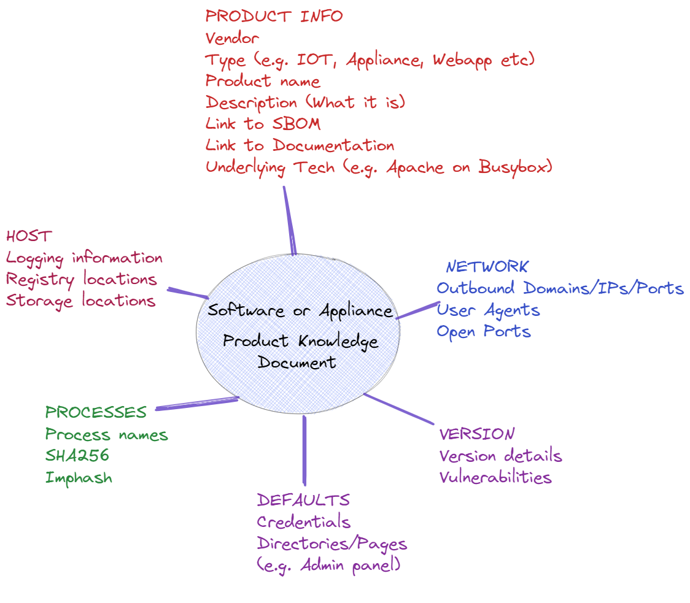

# Product Knowledge Documents
YAML Files describing specific details of vendor appliances and software to aid understanding and investigation. Essentially supporting a software bill of materials with some extra fields that are useful for attributing process and network details to the software or appliance. 

Stored in a "PKD" - Product Knowledge Document, a YAML file with useful fields.

##

##

##

