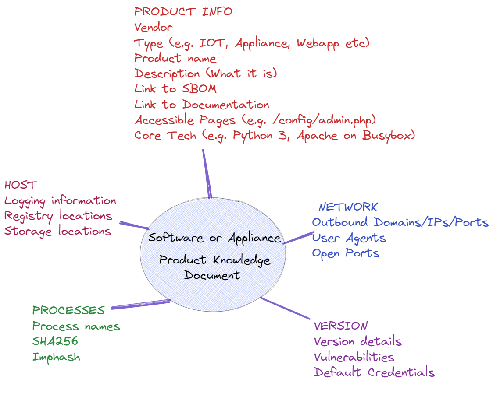

# Product Knowledge Documents
YAML Files describing specific details of vendor appliances and software to aid understanding and investigation. Essentially supporting a software bill of materials with some extra fields that are useful for attributing process and network details to the software or appliance. 

Stored in a "PKD" - Product Knowledge Document, a YAML file with useful fields.

##

##

##
*Thoughts and updates as I research this*

https://devblogs.microsoft.com/engineering-at-microsoft/generating-software-bills-of-materials-sboms-with-spdx-at-microsoft/ and ISO/IEC 5962:2021 - https://spdx.github.io/spdx-spec/ - The software bill of materials (SBOM) and this standard (SPDX) is designed to standardise an approach to the various dependencies in software. There's some interesting components in this such as "the ability to validate the hashes of all files listed in the SBOM against the hashes of the build drop itself and validate that the digital signature on the SBOM is the trusted signature from Microsoft." 

That being said, I feel that there's still room for information that's useful from someone who's trying to understand items on their network. Very often in my experience understanding the lines between the legitimate and potentially malicious can be blurred. With the ability to tie processes or network artifacts back to software or specific appliances, the spotlight can focus more on the gaps - or at least the software or appliances that are not authorised to be there or may be out-of-date.

Rather than relying on vulnerability management tools to actively go out and scan the network for discovery, we could turn it on it's head and use things like the network indicators and/or process names/hashes as a way of generating this insight. 

Like the above SBOM standard, I think generating this information in a standard could be done not only for externally available tools but by inhouse software. I'm not a software developer at all, so again maybe there's additional fields which could be of utility. 

I envisage that either vendors or the community publish a standardised structure like this like they do with the SBOM.

I'm doing a bit of research around this so will adjust as I learn more or find I'm reinventing the wheel. Perhaps it'll be more appropriate that something like SPDX starts to add other information as an addition - who knows?

##

Potential fields:

###PRODUCT OVERVIEW###

**id:**
 -  An ID field for this particular version

**vendor name:**
  - Self explanatory, may not be a "vendor" per-se, but it should best describe who "owns" it for maintenance

**product_type:**
- The type of product this is, needs defining however it will be things like "IOT/Security Appliance/Web App/"

**product name:**
- Self explanatory

**product version:**
- v1.9

**PKD author:**
- Martin Connarty

**product description:**
- A quick description of what the product does and its purpose, and maybe a bit about how it works. I have found this can be difficult to determine sometimes and have had to trawl through websites to find this.

**SBOM:**
- A link to the Software Bill of Materials for this software or appliance

**accessible_pages:**
- For things offering a web page Any default pages for access, such as where the admin panel is found
 
**core_tech:**
- Not in the depth of the SBOM, but essentially what it runs on. E.g. Python 3, or Apache on Windows Server. Just to give someone at a glance an idea of what it's core
 
###NETWORK###

**known_domains:**
  - Domains that this is known to communicate to, in order to confirm legitimate traffic

**known_ips:**
  - IP addreses this is known to communicate to, again in order to help confirm legitimate traffic

**user_agents:**
  - Any known user agents that this uses

**open_ports:**
 - Any ports that this has open
 
###-HOST###

**registry_keys:**
  - All of the known registry key locations
  
**logging_details:**
  - Details of where logs may be found and what they log

**storage_locations:**
  - Details of where the product stores it's files, e.g. %programdata%/product name

###PROCESS###

**process_names:**
  - Names of the processes you are likely to see
  -
**process_sha256**
 - Sub attribution of the process name - List of all the SHA256 hashes, things like any DLLs or any other files that were developed as part of this product. This would not extend to the dependencies.
 
**imphashes:**
  - Sub attribution of the process name - Import hashes of these processes 

###VERSION###

**version description:**
- Any particular details or changes that were introduced to the version

**vulnerabilities:**
  - Details of any known vulnerabilities

**default_credentials:**
- Any default credentials
